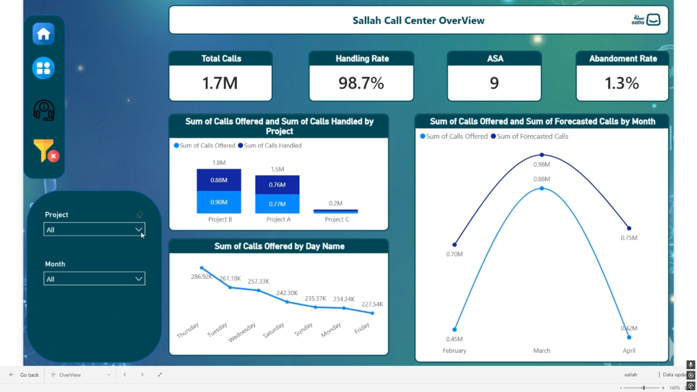

# Power BI Sales/Business Dashboard | لوحة تحكم Power BI 📊

Watch the full interactive dashboard demo on LinkedIn(https://www.linkedin.com/posts/ahmed-ghanem-415584350_%D8%B3%D8%B9%D9%8A%D8%AF-%D8%AC%D8%AF%D8%A7-%D8%A8%D9%85%D8%B4%D8%A7%D8%B1%D9%83%D8%A9-%D8%A3%D9%88%D9%84-%D9%85%D8%B4%D8%B1%D9%88%D8%B9-%D9%84%D9%8A-%D8%A8%D8%A7%D8%B3%D8%AA%D8%AE%D8%AF%D8%A7%D9%85-power-activity-7449532422704168960-p-he?utm_source=share&utm_medium=member_desktop&rcm=ACoAAFemYVEBoTWr3TvYkghaj_BS2V6ZIs7b_bg)

**[English Below]**

مشروع تحليل بيانات متقدم باستخدام Power BI. قمت في هذا المشروع بربط مصادر البيانات وتحويلها باستخدام Power Query، وبناء نموذج بيانات (Data Model) قوي، مع استخدام لغة DAX لإنشاء مقاييس (Measures) متقدمة تساعد في استخراج رؤى دقيقة وتفاعلية.

---

## 🎯 Project Overview
This project showcases the end-to-end Power BI workflow. It transforms complex datasets into a user-friendly dashboard that tracks business performance and trends through interactive visuals.

## 🚀 Key Technical Features
* **ETL Process:** Used **Power Query** to clean and transform raw data.
* **Data Modeling:** Built a Star Schema model to ensure optimized performance.
* **Advanced DAX:** Created measures for (Total Sales, YTD, YoY Growth, and Target tracking).
* **Interactive UI:** Designed a professional layout with bookmarks, tooltips, and slicers for seamless navigation.

## 🛠️ Tools & Technologies
* **Power BI Desktop**
* **DAX (Data Analysis Expressions)**
* **Power Query**

## 💡 Key Insights
* Visualized key growth drivers and identified underperforming segments.
* Enabled deep-dive analysis into time-based trends and regional distribution.

---
> *"Data is the new oil, but visualization is the engine."* 🚀
